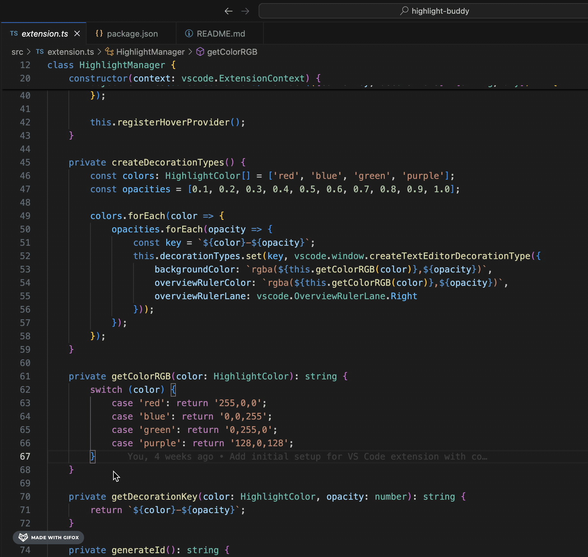

# Highlight Buddy

A powerful Visual Studio Code extension for code highlighting with multiple colors, customizable opacity, and intuitive management features. Perfect for code reviews, presentations, or personal reference.

## Features

- Multiple color options (Blue, Red, Green, Purple)
- Adjustable opacity levels (0.2 to 1.0)
- Quick highlighting with keyboard shortcuts
- Hover menu for quick actions
- Multiple overlapping highlights support
- Minimap visibility
- Full line highlighting
- Cross-file highlight management

## Preview

## Installation

1. Install from VS Code Marketplace by searching for "Highlight Buddy"
2. Or install the VSIX file directly from VS Code
3. Restart VS Code after installation

## Usage

### Basic Highlighting

1. **Quick Highlight**

   - Select text you want to highlight (or place cursor on a line)
   - Press `Shift+Cmd+K` (macOS) or `Ctrl+Alt+K` (Windows/Linux) to highlight with last used color
   - If no text is selected, the entire line will be highlighted

2. **Managing Highlights**

   - Hover over any highlighted text to see options:
     - "Change Color": Changes the color of that specific highlight
     - "Remove Highlight": Removes just that highlight
   - These actions work regardless of cursor position
   - You can also press `Shift+Cmd+L` (macOS) or `Ctrl+Alt+L` (Windows/Linux) to remove a highlight at cursor position

3. **Using Different Colors**

   - Via Command Palette (`Cmd+Shift+P`):
     - "Highlight Buddy: Highlight Selection (Red)"
     - "Highlight Buddy: Highlight Selection (Blue)"
     - "Highlight Buddy: Highlight Selection (Green)"
     - "Highlight Buddy: Highlight Selection (Purple)"
   - Or use hover menu to change colors of existing highlights

4. **Customizing Opacity**

   - Open Command Palette
   - Select "Highlight Buddy: Highlight Selection with Opacity"
   - Enter a value between 0 and 1 (e.g., 0.5 for 50% opacity)

5. **Clearing Highlights**
   - To remove all highlights across all files:
     - Open Command Palette
     - Select "Highlight Buddy: Clear All Highlights"
   - To remove a specific highlight:
     - Hover over the highlight
     - Click "Remove Highlight"
     - Or place cursor on highlight and press `Shift+Cmd+L` (macOS) or `Ctrl+Alt+L` (Windows/Linux)

### Advanced Features

1. **Multiple Overlapping Highlights**

   - You can highlight code that's already highlighted
   - Highlights won't interfere with each other
   - Great for marking multiple aspects of the same code

2. **Full Line Highlighting**

   - Place cursor anywhere in a line (no selection needed)
   - Press `Shift+Cmd+K` (macOS) or `Ctrl+Alt+K` (Windows/Linux) to highlight the entire line

3. **Minimap Integration**
   - Highlights are visible in the minimap
   - Makes it easy to navigate through highlighted sections

## Default Settings

- Default Color: Blue
- Default Opacity: 0.8
- Default Shortcuts:
  - Highlight: `Shift+Cmd+K` (macOS) or `Ctrl+Alt+K` (Windows/Linux)
  - Remove Highlight: `Shift+Cmd+L` (macOS) or `Ctrl+Alt+L` (Windows/Linux)

## Notes

- Highlights persist between VS Code sessions
- Color and opacity preferences are remembered
- Multiple files can have highlights simultaneously
- Supports all file types

## Contributing

Feel free to submit issues and enhancement requests on the [GitHub repository](https://github.com/Siddarthsangavi/highlight-buddy).

## License

This extension is released under the [MIT License](LICENSE).
